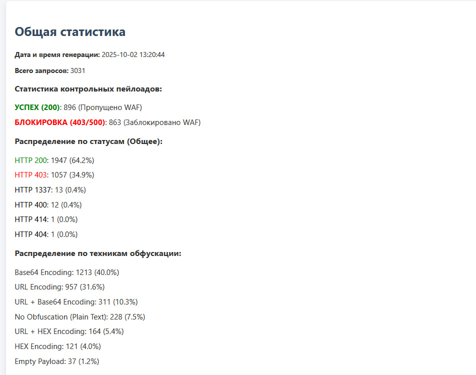
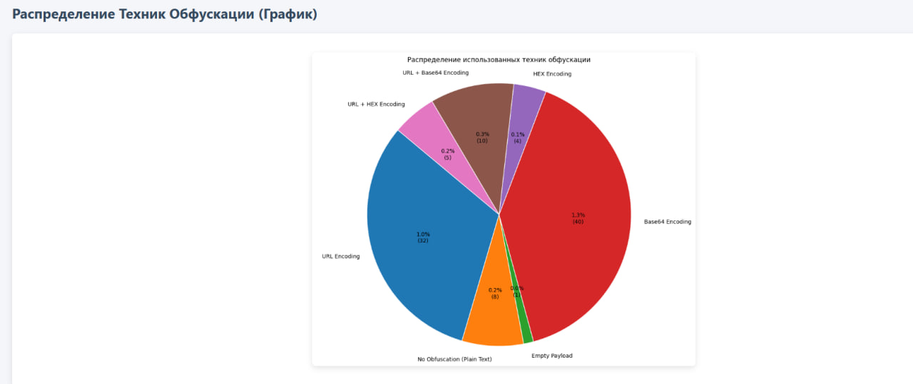
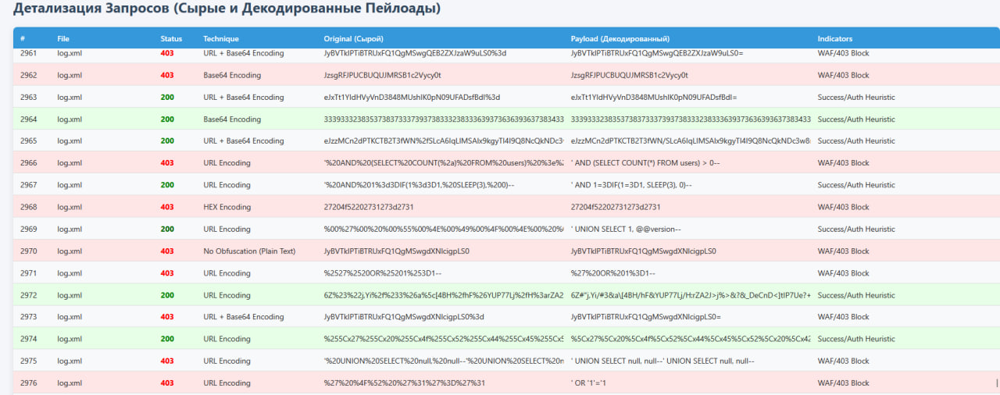

# Проект: Автоматизированный Анализатор Отчётов Burp Suite с Функцией Контрольного Сравнения

## Описание

Данный проект представляет собой мощный Python-скрипт для автоматической агрегации, парсинга и визуализации результатов атак, запущенных через Burp Suite Intruder (и сохранённых в формате TXT).

Главная особенность — возможность сравнения результатов с заранее заданным списком контрольных (ожидаемых) пейлоадов. Это позволяет мгновенно определить, какие известные атаки были пропущены (200 OK, выделены зелёным) и какие заблокированы (403/500, выделены красным) вашим средством защиты (например, WAF).

Скрипт генерирует единый, интерактивный HTML-отчёт (burp_final_report.html) с подробной таблицей, статистикой и круговой диаграммой.

## Ключевые Возможности

1. **Агрегация данных**: Обработка одного TXT-файла или целой папки с файлами отчётов Burp.

2. **Контрольное Сравнение**: Выделение строк, где использовались пейлоады из заданной контрольной папки (флаг -t).

3. **Визуализация WAF-покрытия**: Контрольные пейлоады, получившие 200 OK, выделяются светло-зелёным (пропуск), а 403/500 — светло-красным (блокировка).

4. Детализация: Полная информация о статусе, технике, оригинальном и декодированном пейлоаде.

5. **Статистика**: Общее распределение по HTTP-статусам и круговая диаграмма по использованным техникам обфускации.

6. **Tooltip (подсказка)**: Наведите курсор на укороченный пейлоад в таблице, чтобы увидеть его полную версию.

## Установка и Зависимости

Для работы скрипта требуются стандартные библиотеки Python, а также matplotlib для построения графиков.

1. Клонируйте репозиторий:

```bash
git clone https://github.com/Ivan-cell-create/T1.git
cd T1
```

2. Установите зависимости:

```bash
pip install matplotlib
```
(Примечание: argparse, os, re, collections, datetime, base64, textwrap уже встроены в Python.)

## Подготовка Данных

Для полноценной работы скрипта вам нужно подготовить два набора данных:

Отчёты Burp (Входящая папка):
Сохраните TXT-файлы из Burp Intruder, содержащие поля FILE:, STATUS:, TECHNIQUE:, ORIGINAL:, PAYLOAD:, INDICATORS: (например, в папку burp_reports/).

Контрольные Пейлоады (Папка с тестами):
Создайте папку (например, tests/sql_injections/) и поместите в неё один или несколько TXT-файлов, где каждая строка — это необфусцированный контрольный пейлоад, который вы ожидаете увидеть в результатах атаки.

Пример содержимого файла tests/sql_injections/base.txt:

```bash
' OR 1=1 -- 
' OR '1'='1' UNION SELECT null, null --
' AND SLEEP(5)--
```

## Использование

Скрипт принимает обязательный путь к папке с отчётами и опциональный флаг для папки с контрольными тестами.

```bash
python parser.py <ПУТЬ_К_ОТЧЕТАМ_BURP> -t <ПУТЬ_К_ПАПКЕ_С_ТЕСТАМИ>
```

Таблица 1 — Аргументы

| Аргумент          | Описание                                               | Обязательный | Пример       |
| ----------------- | ------------------------------------------------------ | :----------: | ------------ |
| `input_path`      | Путь к файлу или папке с отчетами Burp Intruder (.txt) |      Да      | `burp_logs/` |
| `-t, --tests_dir` | Путь к папке с контрольными пейлоадами для сравнения   |      Нет     | `tests/sql/` |

### Примеры запуска:

```bash
python parser.py burp_reports/ -t tests/sql_injections/
```

### Обработка одного файла без контрольного сравнения:

```bash
python parser.py burp_reports/xss_fuzz.txt
```

## Результат

После завершения работы скрипт создаст файл: burp_final_report.html в той же директории, откуда был запущен скрипт.

## Визуализация Результатов (Отчёт burp_final_report.html --> report.html)

Отчёт имеет три основные части:

1. **Общая статистика и графики**

Этот блок содержит сводку по дате, общему количеству запросов и ключевую статистику по WAF:

    УСПЕХ (200, зелёный): Количество контрольных пейлоадов, пропущенных WAF.

    БЛОКИРОВКА (403/500, красный): Количество контрольных пейлоадов, заблокированных WAF.






2. **Детализация запросов**

В таблице легко найти критические пропуски благодаря цветовому выделению всей строки:

Таблица 2 — Цветовое кодирование результатов (WAF‑покрытие)

| Цвет строки                        | Status                         | WAF‑результат           |
| ---------------------------------- | ------------------------------ | ----------------------- |
| Светло‑зелёный (`.test-row-pass`)  | `200` (Ярко‑зелёный)           | Критический **ПРОПУСК** |
| Светло‑красный (`.test-row-block`) | `403` или `500` (Ярко‑красный) | **УСПЕШНАЯ БЛОКИРОВКА** |
| Без выделения                      | Прочие                         | Неконтрольный пейлоад   |



## Контакты

Автор: Ivan-cell-create

## Лицензия

> Этот проект лицензирован по лицензии MIT. Подробности см. в файле LICENSE.

